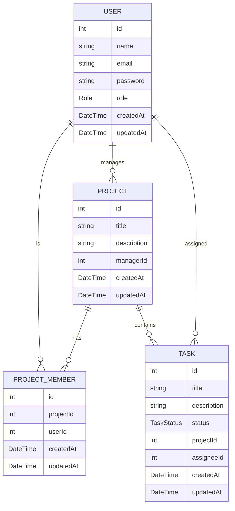
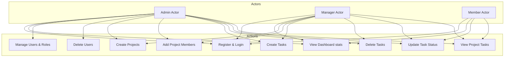
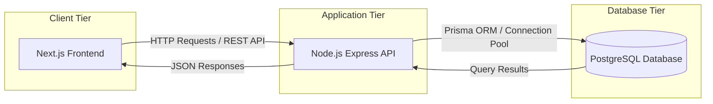

# System Diagrams

This document contains visual diagrams depicting the system data schema, use cases, and deployment architecture.

## Entity Relationship (ER) Diagram

## Use Case Diagram

## System Architecture Diagram

